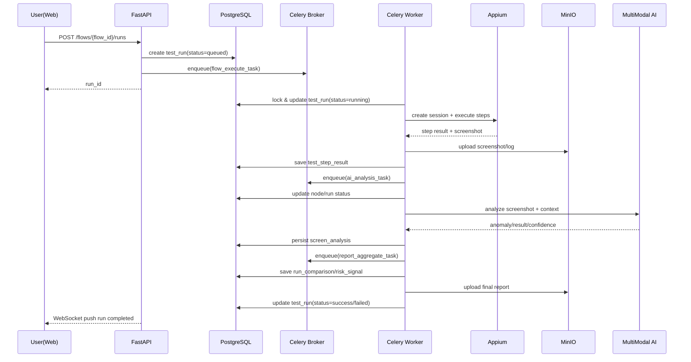

# AI驱动移动端自动化测试管理平台（重新设计）

## 1. 设计原则与总体架构

### 1.1 设计原则
- **平台化优先**：多项目、多租户隔离、资源可复用。
- **执行与管理解耦**：控制面（Web/API）与执行面（Worker/Appium Device Farm）分离。
- **可观测与可追溯**：所有执行步骤、截图、AI结论均可审计。
- **AI增强但可回退**：AI分析结果可解释、可人工覆盖，失败可降级到规则引擎。
- **云原生可扩展**：所有组件支持水平扩展（FastAPI、Celery Worker、Appium Nodes）。

### 1.2 分层架构
1. **接入层**：React + Ant Design 管理后台、OpenAPI、Webhook。
2. **业务层（FastAPI）**：
   - 项目与权限域
   - 用例DSL管理域
   - Flow编排域
   - 执行调度域
   - 报告与风险分析域
3. **任务层（Celery）**：
   - Flow编译任务
   - 执行任务
   - 截图后处理任务
   - AI分析任务
   - 报告聚合任务
4. **执行层（Appium）**：
   - 设备池管理
   - Session创建与回收
   - 步骤执行与截图
5. **数据层**：
   - PostgreSQL（元数据、状态、版本、指标）
   - MinIO（截图、视频、日志、报告产物）
6. **AI能力层**：多模态模型接口（页面理解、对比分析、风险打分建议）

### 1.3 核心服务拆分建议
- `api-gateway`：统一鉴权、路由与审计日志。
- `test-core-service`：用例、Flow、执行、报告核心业务。
- `scheduler-service`：计划调度与队列编排。
- `runner-service`：Appium执行代理（可与Celery Worker合并部署）。
- `ai-analysis-service`：多模态调用适配、Prompt模板管理、结果标准化。
- `asset-service`：MinIO文件签名、生命周期管理。

---

## 2. 数据库模型设计（PostgreSQL）

> 采用 `UUID + 时间戳`，关键表包含 `created_at/updated_at/deleted_at`（软删除可选）。

### 2.1 组织与项目域

#### `tenant`
- `id` (uuid, pk)
- `name` (varchar)
- `status` (varchar) // active, suspended

#### `user`
- `id` (uuid, pk)
- `tenant_id` (uuid, fk -> tenant.id)
- `email` (varchar, unique)
- `name` (varchar)
- `role` (varchar) // owner, admin, qa, viewer

#### `project`
- `id` (uuid, pk)
- `tenant_id` (uuid, fk)
- `name` (varchar)
- `platform` (varchar) // ios/android/hybrid
- `repo_url` (varchar)
- `default_branch` (varchar)

### 2.2 测试资产域

#### `test_case`
- `id` (uuid, pk)
- `project_id` (uuid, fk)
- `name` (varchar)
- `description` (text)
- `dsl_version` (int)
- `dsl_content` (jsonb)
- `tags` (jsonb)
- `status` (varchar) // draft, active, archived

索引：`(project_id, status)`、GIN(`tags`)

#### `test_case_version`
- `id` (uuid, pk)
- `test_case_id` (uuid, fk)
- `version_no` (int)
- `dsl_content` (jsonb)
- `change_log` (text)
- `created_by` (uuid)

#### `test_flow`
- `id` (uuid, pk)
- `project_id` (uuid, fk)
- `name` (varchar)
- `graph_json` (jsonb) // DAG节点、边、条件
- `entry_node` (varchar)
- `status` (varchar)

#### `flow_node_binding`
- `id` (uuid, pk)
- `flow_id` (uuid, fk)
- `node_key` (varchar)
- `test_case_id` (uuid, fk)
- `retry_policy` (jsonb)
- `timeout_sec` (int)

### 2.3 执行与设备域

#### `device_pool`
- `id` (uuid, pk)
- `project_id` (uuid, fk)
- `name` (varchar)
- `provider` (varchar) // local, cloud

#### `device`
- `id` (uuid, pk)
- `pool_id` (uuid, fk)
- `udid` (varchar)
- `platform` (varchar)
- `platform_version` (varchar)
- `model` (varchar)
- `status` (varchar) // idle, busy, offline
- `capabilities` (jsonb)

#### `test_plan`
- `id` (uuid, pk)
- `project_id` (uuid, fk)
- `name` (varchar)
- `trigger_type` (varchar) // manual, cron, webhook
- `cron_expr` (varchar, nullable)
- `flow_id` (uuid, fk)
- `env_config` (jsonb)

#### `test_run`
- `id` (uuid, pk)
- `project_id` (uuid, fk)
- `plan_id` (uuid, fk, nullable)
- `flow_id` (uuid, fk)
- `run_no` (varchar)
- `status` (varchar) // queued, running, success, failed, partial
- `triggered_by` (uuid)
- `started_at` (timestamp)
- `finished_at` (timestamp)
- `summary` (jsonb)

索引：`(project_id, started_at desc)`、`(status)`

#### `test_run_node`
- `id` (uuid, pk)
- `test_run_id` (uuid, fk)
- `node_key` (varchar)
- `test_case_id` (uuid)
- `device_id` (uuid)
- `status` (varchar)
- `attempt` (int)
- `duration_ms` (int)
- `error_code` (varchar)
- `error_message` (text)

#### `test_step_result`
- `id` (uuid, pk)
- `run_node_id` (uuid, fk)
- `step_index` (int)
- `action` (varchar)
- `input_payload` (jsonb)
- `status` (varchar)
- `assertion_result` (jsonb)
- `screenshot_object_key` (varchar)
- `raw_log_object_key` (varchar)

### 2.4 AI分析与报告域

#### `screen_analysis`
- `id` (uuid, pk)
- `test_step_result_id` (uuid, fk)
- `model_name` (varchar)
- `prompt_version` (varchar)
- `analysis_type` (varchar) // ui_state, anomaly, element_detect
- `result_json` (jsonb)
- `confidence` (numeric)
- `latency_ms` (int)

#### `run_comparison`
- `id` (uuid, pk)
- `project_id` (uuid, fk)
- `baseline_run_id` (uuid)
- `target_run_id` (uuid)
- `diff_summary` (jsonb)
- `risk_score` (numeric)
- `report_object_key` (varchar)

#### `risk_signal`
- `id` (uuid, pk)
- `test_run_id` (uuid, fk)
- `signal_type` (varchar) // crash, layout_shift, flaky, perf_regression
- `weight` (numeric)
- `value` (numeric)
- `evidence_json` (jsonb)

### 2.5 审计与可观测

#### `audit_log`
- `id` (uuid, pk)
- `tenant_id` (uuid)
- `user_id` (uuid)
- `action` (varchar)
- `resource_type` (varchar)
- `resource_id` (uuid)
- `payload` (jsonb)
- `created_at` (timestamp)

#### `event_outbox`
- `id` (uuid, pk)
- `event_type` (varchar)
- `aggregate_id` (uuid)
- `payload` (jsonb)
- `status` (varchar)

---

## 3. 后端API接口定义（FastAPI）

### 3.1 鉴权与通用
- `POST /api/v1/auth/login`
- `GET /api/v1/me`
- `GET /api/v1/health`

### 3.2 项目与设备
- `POST /api/v1/projects`
- `GET /api/v1/projects`
- `GET /api/v1/projects/{project_id}`
- `POST /api/v1/projects/{project_id}/device-pools`
- `GET /api/v1/projects/{project_id}/devices`
- `PATCH /api/v1/devices/{device_id}/status`

### 3.3 用例DSL管理
- `POST /api/v1/projects/{project_id}/cases`
- `GET /api/v1/projects/{project_id}/cases`
- `GET /api/v1/cases/{case_id}`
- `PUT /api/v1/cases/{case_id}`
- `POST /api/v1/cases/{case_id}/versions`
- `POST /api/v1/cases/validate-dsl`

**DSL示例（JSON）**
```json
{
  "name": "LoginCase",
  "steps": [
    {"action": "launch_app", "params": {}},
    {"action": "input", "target": "id=username", "value": "tester"},
    {"action": "input", "target": "id=password", "value": "***"},
    {"action": "tap", "target": "id=btn_login"},
    {"action": "assert", "expr": "exists(id=home_banner)"}
  ]
}
```

### 3.4 Flow编排
- `POST /api/v1/projects/{project_id}/flows`
- `GET /api/v1/projects/{project_id}/flows`
- `GET /api/v1/flows/{flow_id}`
- `PUT /api/v1/flows/{flow_id}`
- `POST /api/v1/flows/{flow_id}/compile`

### 3.5 执行调度
- `POST /api/v1/projects/{project_id}/plans`
- `POST /api/v1/plans/{plan_id}/trigger`
- `POST /api/v1/flows/{flow_id}/runs`
- `GET /api/v1/runs/{run_id}`
- `GET /api/v1/runs/{run_id}/nodes`
- `GET /api/v1/runs/{run_id}/steps`
- `POST /api/v1/runs/{run_id}/cancel`

### 3.6 AI分析与报告
- `POST /api/v1/runs/{run_id}/ai-analyze`
- `GET /api/v1/runs/{run_id}/ai-summary`
- `POST /api/v1/runs/compare`
- `GET /api/v1/comparisons/{comparison_id}`
- `GET /api/v1/runs/{run_id}/risk-score`

### 3.7 文件访问
- `POST /api/v1/assets/presign-upload`
- `POST /api/v1/assets/presign-download`

---

## 4. 核心目录结构（Monorepo示例）

```text
ai-mobile-test-platform/
├── apps/
│   ├── backend/
│   │   ├── app/
│   │   │   ├── api/
│   │   │   │   ├── v1/
│   │   │   │   │   ├── auth.py
│   │   │   │   │   ├── projects.py
│   │   │   │   │   ├── cases.py
│   │   │   │   │   ├── flows.py
│   │   │   │   │   ├── runs.py
│   │   │   │   │   ├── ai_reports.py
│   │   │   ├── core/          # config, security, logging
│   │   │   ├── domain/        # 领域实体与规则
│   │   │   ├── schemas/       # pydantic models
│   │   │   ├── services/      # 用例服务、执行服务、AI服务
│   │   │   ├── repositories/  # DB访问层
│   │   │   ├── tasks/         # Celery tasks
│   │   │   ├── integrations/  # appium/minio/llm adapters
│   │   │   └── main.py
│   │   ├── migrations/
│   │   └── tests/
│   ├── worker/
│   │   ├── celery_app.py
│   │   ├── runners/
│   │   │   ├── flow_runner.py
│   │   │   └── case_runner.py
│   │   └── tests/
│   └── web/
│       ├── src/
│       │   ├── pages/
│       │   ├── components/
│       │   ├── services/
│       │   ├── store/
│       │   └── routes/
│       └── package.json
├── packages/
│   ├── dsl-engine/
│   ├── flow-compiler/
│   ├── ai-adapter-sdk/
│   └── shared-types/
├── deploy/
│   ├── docker-compose.yml
│   ├── k8s/
│   └── observability/
└── docs/
    ├── architecture.md
    ├── dsl-spec.md
    └── api-contract.yaml
```

---

## 5. 执行流程时序图

### 5.1 手动触发执行



### 5.2 版本对比流程
1. 选择基线运行 `baseline_run_id` 与目标运行 `target_run_id`。
2. 拉取两次运行的同节点同步骤截图。
3. 先做像素/结构化规则对比，再调用AI做语义差异解释。
4. 汇总差异项（功能差异、UI差异、性能信号）。
5. 生成风险评分并输出可读报告（存储至MinIO）。

---

## 6. 前端页面结构设计（React + Ant Design）

### 6.1 路由规划
- `/login`
- `/projects`
- `/projects/:id/dashboard`
- `/projects/:id/cases`
- `/projects/:id/cases/:caseId/edit`
- `/projects/:id/flows`
- `/projects/:id/flows/:flowId/designer`
- `/projects/:id/plans`
- `/projects/:id/runs`
- `/projects/:id/runs/:runId`
- `/projects/:id/comparisons/:comparisonId`
- `/projects/:id/settings/devices`

### 6.2 页面模块
1. **Dashboard**
   - 今日执行趋势
   - 通过率/失败率
   - 高风险TopN
   - AI异常分类占比
2. **用例管理**
   - 表格 + 标签过滤
   - DSL编辑器（Monaco）
   - DSL语法校验与预览
3. **Flow设计器**
   - DAG可视化拖拽
   - 节点绑定测试用例
   - 条件分支配置
4. **执行中心**
   - 计划任务管理
   - 实时运行状态（WebSocket）
   - 失败重跑/节点重跑
5. **运行详情**
   - Step时间线
   - 截图画廊
   - 日志与错误栈
   - AI分析摘要与置信度
6. **版本对比报告**
   - 基线 vs 目标
   - 差异热区标注
   - 风险评分解释（可追溯到信号）

### 6.3 状态管理建议
- 使用 `Redux Toolkit + RTK Query`。
- 查询缓存按 `project_id + resource_id` 分区。
- WebSocket事件统一进入 `runSlice`，避免页面各自监听。

---

## 7. 关键代码示例（核心模块）

### 7.1 FastAPI 执行触发接口

```python
# apps/backend/app/api/v1/runs.py
from fastapi import APIRouter, Depends
from app.schemas.run import RunCreateRequest, RunCreateResponse
from app.services.run_service import RunService

router = APIRouter(prefix="/api/v1")

@router.post("/flows/{flow_id}/runs", response_model=RunCreateResponse)
def create_run(flow_id: str, payload: RunCreateRequest, svc: RunService = Depends()):
    run = svc.create_run(flow_id=flow_id, trigger=payload.trigger, env=payload.env)
    svc.enqueue_run(run.id)
    return RunCreateResponse(run_id=run.id, status=run.status)
```

### 7.2 Celery 执行任务编排

```python
# apps/backend/app/tasks/run_tasks.py
from celery import shared_task
from app.services.executor import FlowExecutor

@shared_task(bind=True, autoretry_for=(Exception,), retry_backoff=True, max_retries=3)
def execute_flow_task(self, run_id: str):
    executor = FlowExecutor(run_id)
    executor.prepare()
    for node in executor.iter_nodes():
        executor.execute_node(node)
    executor.finalize()
```

### 7.3 Appium 适配层（解耦）

```python
# apps/backend/app/integrations/appium/client.py
from appium import webdriver

class AppiumClient:
    def __init__(self, server_url: str):
        self.server_url = server_url

    def create_session(self, caps: dict):
        return webdriver.Remote(self.server_url, caps)

    def run_step(self, driver, step: dict):
        action = step["action"]
        if action == "tap":
            driver.find_element("id", step["target"].split("=")[1]).click()
        elif action == "input":
            el = driver.find_element("id", step["target"].split("=")[1])
            el.clear()
            el.send_keys(step["value"])
        elif action == "assert":
            # 示例：真实项目应接入表达式引擎
            return True
        return True
```

### 7.4 AI分析服务标准化输出

```python
# apps/backend/app/services/ai_service.py
class AIAnalysisService:
    def __init__(self, multimodal_client):
        self.client = multimodal_client

    def analyze_screen(self, image_url: str, context: dict) -> dict:
        prompt = {
            "task": "mobile_ui_anomaly_detection",
            "context": context,
            "output_schema": {
                "anomaly": "bool",
                "category": "string",
                "summary": "string",
                "confidence": "float"
            }
        }
        result = self.client.infer(image_url=image_url, prompt=prompt)
        return {
            "anomaly": bool(result.get("anomaly", False)),
            "category": result.get("category", "unknown"),
            "summary": result.get("summary", ""),
            "confidence": float(result.get("confidence", 0.0)),
        }
```

### 7.5 风险评分引擎

```python
# apps/backend/app/services/risk_engine.py
from dataclasses import dataclass

@dataclass
class RiskSignal:
    signal_type: str
    weight: float
    value: float

class RiskEngine:
    def score(self, signals: list[RiskSignal]) -> float:
        weighted = sum(s.weight * s.value for s in signals)
        max_score = sum(s.weight for s in signals) or 1.0
        return round((weighted / max_score) * 100, 2)
```

---

## 8. 可扩展性与演进路线

### 8.1 横向扩展
- FastAPI + Gunicorn/Uvicorn 多实例。
- Celery Worker 按队列拆分：`run_queue`、`ai_queue`、`report_queue`。
- Appium节点按设备类型扩容（Android/iOS独立池）。

### 8.2 高可用与一致性
- 关键状态流转使用数据库事务 + Outbox事件。
- 幂等键：`run_no`、`task_id` 防止重复触发。
- 失败恢复：节点级checkpoint，可断点续跑。

### 8.3 安全与合规
- MinIO对象使用短时签名URL。
- 敏感字段（账号、密码、token）加密存储。
- AI请求脱敏（遮盖PII）与审计留痕。

### 8.4 后续增强
- Flaky Test 检测（历史波动模型）。
- 智能自愈（定位器漂移自动修复建议）。
- 结合埋点/崩溃平台形成跨域风险画像。

